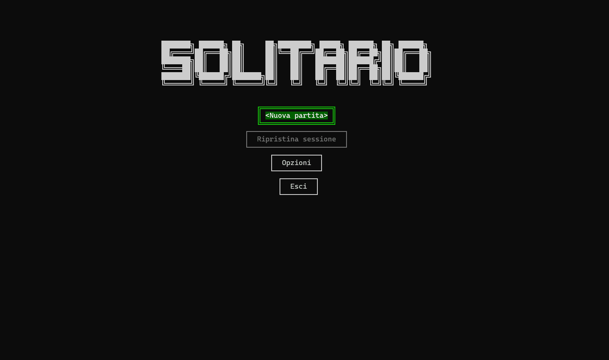

# Gigathon 2025 - Solitario

Questo è un classico gioco di Solitario (Klondike) sviluppato in C# per la console, come progetto per la sfida di programmazione Gigathon (fascia 16-18 anni).

## Indice
- [Features](#features)
- [Come eseguire](#come-eseguire)
    - [Requisiti](#requisiti)
    - [Istruzioni](#istruzioni)
- [Comandi](#comandi)
- [Architettura](#architettura)
- [Note](#note)

## Features
- ✅ **Zero dipendenze**: non è richiesta alcuna installazione di dipendenze esterne
- 💾 **Salvataggio e caricamento**: Puoi salvare i tuoi progressi e riprenderli in qualsiasi momento
- ↩️ **Funzionalità annulla**: Ogni mossa può essere annullata
- 💡 **Suggerimenti**: Se sei bloccato, puoi chiedere un suggerimento

## Come eseguire
### Requisiti
- .NET 8.0 SDK (o versione successiva).

### Istruzioni
#### Apri con Visual studio
1. Fare doppio click su `Gigathon.sln`
2. Selezionare il progetto `Solitario`
3. Eseguirlo

#### Eseguire in un terminale
1. Estrai lo Zip
2. Naviga alla cartella Solitario
2. Esegui `dotnet run`

## Comandi
L'interfaccia viene interamente controllata da tastiera

| Tasto              | Azione                                     |
| -----------------  | ------------------------------------------ |
| **Freccie ←↑→↓**   | Muovi cursore/selezione                    |
| **Spazio / Invio** | **Seleziona** elementi.                    |
| **R**              | **Pesca** una carta dalla cima del mazzo   |
| **E**              | **Seleziona** la carta in cima agli scarti |
| **F**              | **Sposta** automaticamente (se possibile) una carta dal tableau o dagli scarti alle fondazioni |
| **X**              | **Annulla** selezione corrente             |
| **Z**              | **Annulla** ultima mossa eseguita          |
| **H**              | Richiedi un **suggerimento**               |
| **Esc**            | Apri menu di **pausa**                     |

## Architettura
Il progetto è stato pensato per essere modulare, manutenibile e scalabile.

- `Activities/`: Contiene un piccolo framework per la gestione delle schermate (ispirato da Android), come il Menu principale, la schermata di Gioco e le Impostazioni.
- `Game/`: Contiene tutto il core del gioco
    - `Models/`: Definiscono oggetti di base
    - `Managers/`: Classi che specializzandosi in un solo compito gestiscono le varie parti del gioco
    - `Rendering/`: Classi responsabili del rendering
    - `Helpers/`: Contiene classi di utilità come `Validator` per la logica delle mosse e `Hint` per l'algoritmo dei suggerimenti
- `Utils/`: Contiene classi di utilità varie

## Note
### Regola del mazzo di riserva
Il documento specificava che "Se il mazzo si svuota, deve essere mescolato e utilizzato nuovamente".
Nel solitario classico però la pila degli scarti va capovolta **senza rimescolarla**.

Di conseguenza sono andato per una via di mezzo, implementando entrambe le logiche.
Ho aggiungo una voce al menu "Opzioni", disabilitata di default, per abilitare il rimescolo come detto nel documento

### Punteggio
Il punteggio viene calcolato in base in base al tempo, il tipo di mosse e il numero di esse.