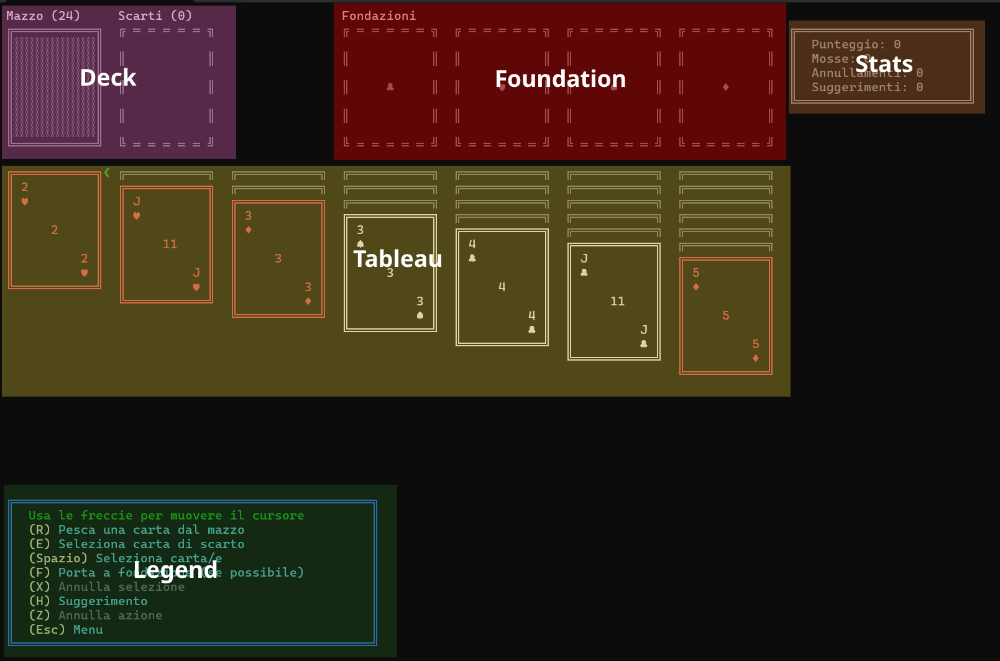

# Documentazione
Ogni (o almeno, quasi ogni) funzione è stata commentata via XML. Questo documento serve a spiegare più in dettaglio l'architettura e come funzionano certi componenti.

Ho cercato di fare il tutto seguendo il più possibile pattern **MVC**.

## Indice
- [Architettura dettagliata](#architettura-dettagliata)
  - [Program.cs](#programcs)
  - [Activity manager](#activity-manager)
  - [Core del gioco](#core-del-gioco)

## Architettura dettagliata
### 1. `Program.cs` (Entry point)
Questo è il file principale da dove parte il programma.

Quando viene avviato, vengono eseguite le seguenti azioni:

1. Imposta titolo, codifica di output etc. della console
2. Istanzia l'[activity manager](#activity-manager) e carica la prima attività
3. Spawna un nuovo thread in background per gestire il ridimensionamento
4. Entra in un ciclo `while` che attende l'input dell'utente tramite `Console.ReadKey(true)`. Questo approccio è efficiente perché il thread principale rimane bloccato finché un tasto non viene premuto, evitando di consumare CPU inutilmente. L'input viene poi passato all'[ActivityManager](#activity-manager) per essere gestito.
### 2. Activity manager
L'activity manager gestice le schermate e le finestre modali che vanno mostrate sullo schermo e redirige eventuali input utenti ad esse.

Ogni attività deve essere una istanza di [IActivity](../Solitario/Activities/Data/IActivity.cs) (situata in `Solitario/Activities/Data`),
e contiene metodi basici per una attività, che sono:
```csharp
  void OnEnter();
  void Draw();
  (int, int) GetMinSize();
  internal void HandleInput(ConsoleKeyInfo keyInfo);
```

L'activity manager invoca i metodi quando necessario e gestice le dimensioni minime della console in base all'attività corrente.

Sono presenti anche altre cartelle, di seguito una breve descrizione di esse:
- `Components/`: Componenti che possono essere usati in ogni attività, come ad esempio i bottoni o le finestre di dialogo.
- `Models/`: Cartella di modelli generici.
- `Rendering/`: Contiene classi per il rendering di elementi grafici, come ad esempio i bottoni.
- `Screens/`: Contiene tutte le schermate del gioco

### 3. Core del gioco
Tutta la logica del gioco è situata nella cartella `Solitario/Game`.

Può funzionare anche senza l'activity manager, l'attività [GameActivity](../Solitario/Activities/Screens/GameActivity.cs) infatti fa da "wrapper" e gestisce parti minori di esso.

#### Model
Il modello rappresenta lo stato del gioco e le regole.

- `Managers/`: Classi specializzate nel gestire una specifica parte di gioco.
    - [Deck](../Solitario/Game/Managers/Deck.cs): Gestisce il mazzo di carte, le carte pescate e quelle scartate.
    - [Tableau](../Solitario/Game/Managers/Tableau.cs): Gestisce le pile di carte sul tavolo.
    - [Actions](../Solitario/Game/Managers/Actions.cs): Gestisce il **command pattern** per le azioni di gioco e salva in uno [Stack](https://learn.microsoft.com/en-us/dotnet/api/system.collections.stack?view=net-9.0) le azioni di gioco
    - [Stats](../Solitario/Game/Managers/Stats.cs): Calcola e memorizza le statistiche di gioco (punteggio, mosse, tempo).
    - [Cursor](../Solitario/Game/Managers/Cursor.cs): Gestisce il cursore del mouse, che può essere usato per selezionare le carte.

- `Models/`: Contiene i modelli di gioco, come ad esempio la definizione di una carta.
    - [Card](../Solitario/Game/Models/Card.cs): Rappresenta una singola carta con seme, valore e stato (coperta/scoperta).
    - [IAction](../Solitario/Game/Models/Actions/IAction.cs): Interfaccia che ogni tipo di azione del command pattern deve implementare.

#### 2. View
La view si occupa di disegnare lo stato del gioco sulla console. Si trova nella cartella `Solitario/Game/Rendering` e contiene classi per il rendering di carte, pile e altre informazioni di gioco.

Le aree del gioco vengono suddivise in `Deck`, `Foundation`, `Tableau`, `Stats` e `Legend` come in figura.


Struttura della view:
- [Renderer.cs](../Solitario/Game/Rendering/Renderer.cs): Classe principale che direziona le chiamate alle classi apposite.
    - [BoardRenderer.cs](../Solitario/Game/Rendering/Components/BoardRenderer.cs): Si occupa di disegnare gli elementi del tavolo (deck, tableau, foundation)
    - [UIRenderer.cs](../Solitario/Game/Rendering/Components/UIRenderer.cs): Si occupa di disegnare gli elementi dell'interfaccia utente (statistiche, legenda, cursore, etc.)
    - [ActionRenderer.cs](../Solitario/Game/Rendering/Components/ActionRenderer.cs): Dato un oggetto `IAction`, si occupa di disegnare l'azione corrispondente.

#### 3. Controller

Il controller si occupa di gestire l'input dell'utente e di aggiornare il modello di gioco in base ad esso. Si trova nella cartella `Solitario/Game/Controllers` e contiene classi per gestire le azioni del giocatore.

- [InputHandler.cs](../Solitario/Game/Controllers/InputHandler.cs): Interpreta il comando e invoca l'azione corrispondente su [GameController](../Solitario/Game/Controllers/GameController.cs).
- [GameController.cs](../Solitario/Game/Controllers/GameController.cs): Gestice la logica del gioco e utilizza l'[ActionsManager](../Solitario/Game/Managers/Actions.cs) per eseguire le azioni del giocatore.

## Logiche chiave

### Command pattern
Ogni azione del gioco viene rappresentata da una classe che implementa l'interfaccia [IAction](../Solitario/Game/Models/Actions/IAction.cs). I suoi metodi principali sono `Execute()` e `Undo()`.

Con `Execute()` l'azione viene eseguita, mentre con `Undo()` viene eseguita l'azione al contrario, ripristinando lo stato precedente del gioco.

Ogni azione viene aggiunta allo stack delle azioni eseguite, in modo da poter essere annullata in seguito.

### Sistema di suggerimenti
Il sistema di suggerimenti è situtato in [Helpers/Hints](../Solitario/Game/Helpers/Hints.cs) e funziona nel seguente modo:

1. Trova tutte le mosse valide nel tavolo, mosse di tipo
    - Tableau -> Tableau
    - Tableau -> Fondazione
    - Scarti -> Tableau
    - Scarti -> Fondazione
    - Pescare dal mazzo
2. Assegna un punteggio ad ogni mossa (definito in [ActionScores.cs](../Solitario/Game/Helpers/ActionScores.cs))
3. Seleziona la migliore mossa (se esiste)
4. Se esiste, restituisce la mossa selezionata come un oggetto di `IAction` che può essere eseguito facilmente, altrimenti restituisce nullo

### Serializzazione per i salvataggi
Il gioco può essere salvato e ricaricato in formato JSON utilizzando la libreria [System.Text.Json](https://learn.microsoft.com/en-us/dotnet/api/system.text.json?view=net-9.0) e [JsonSerializer](https://learn.microsoft.com/en-us/dotnet/api/system.text.json.jsonserializer?view=net-9.0).

La classe responsabile di tutto ciò è [Helpers/Serializer.cs](../Solitario/Game/Helpers/Serializer.cs), che si occupa di serializzare e deserializzare gli oggetti del gioco in formato JSON e provvede delle funzioni di alto livello che scrivono e leggono direttamente dai file.

**Serializzazione**:
1. Il serializzatore prende gli stati di `Deck`, `Foundation`, `Tableau` e `Stats`
2. Converte il tutto seguendo la struttura `SerializedData` (situata in [Data/SerializedTypes.cs](../Solitario/Game/Data/SerializedTypes.cs)) in un oggetto JSON
3. Il `JsonSerializer` converte l'oggetto in una stringa JSON che viene scritta su file

**Deserializzazione**:
Il processo della deserializzazione è simile, ma in senso inverso:
1. Viene letto il file come stringa.
2. `JsonSerializer` deserializza la stringa seguendo la struttra `SerializedData`
3. Gli stati `Deck`, `Foundation`, `Tableau` e `Stats` vengono ricostruiti e iniettati un una nuova istanza di [Game](../Solitario/Game/Game.cs)